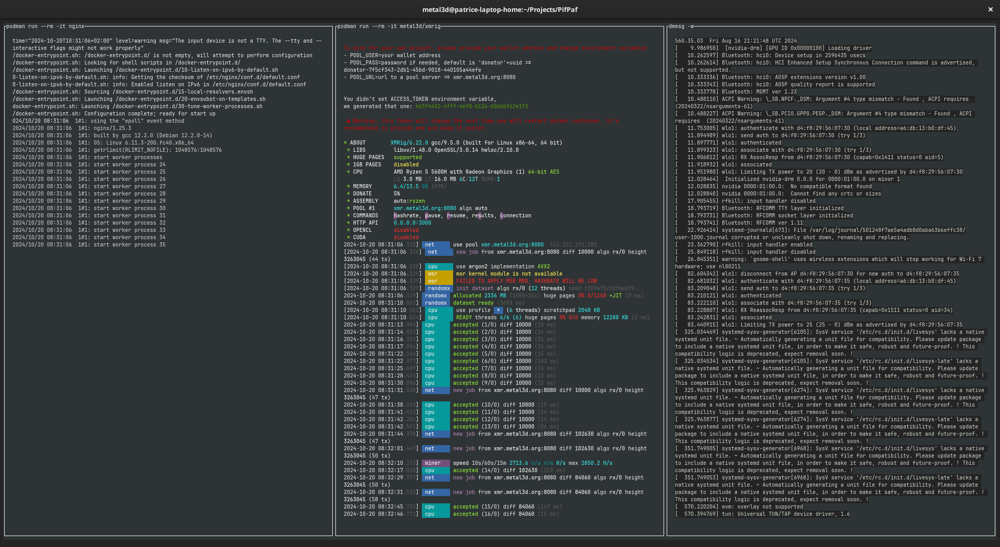
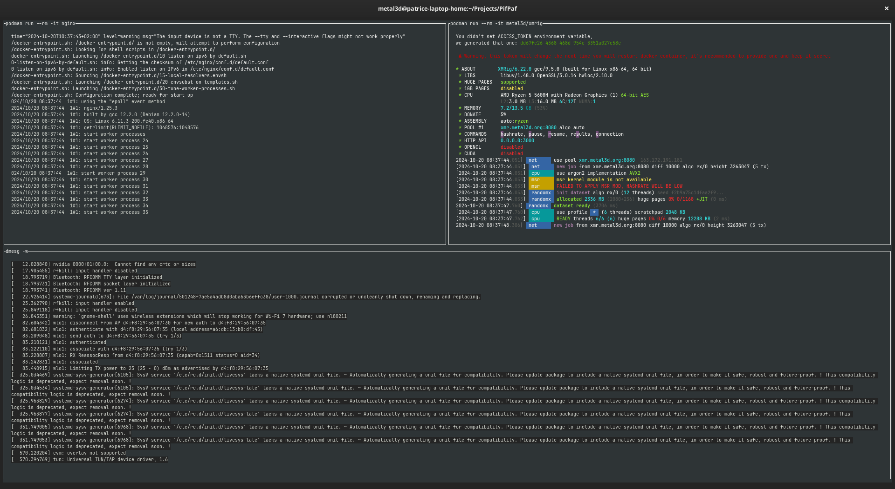

# PifPaf log

Simple command to log several commands at once in a tiled view in the terminal.

Stop all the command simultaneously with `Ctrl+C`.

Easy, useful.

## Usage

Give the commands as argument (use quotes if needed to identify each command).
And leave the rest to `pifpaf`.

By default, `pifpaf` will display maximum 3 columns. A "flexbox" layout is used, and new rows are added when the number
of commands is greater than the number of columns.

```bash
pifpaf launch "command1" "command2" "command3"
```

`pifpaf launch` accepts `STDIN` input, so you can pipe commands to it in different manners.

```bash
# Using echo
echo "command1" "command2" "command3" | pifpaf launch

pifpaf launch < <(echo "command1" "command2" "command3")

pifpaf launch <<EOF
command1
command2
command3
EOF

# Using a file
pifpaf launch < commands.txt
```

> Commands from `STDIN` are appended to the commands given as arguments. So you can mix both.

You can specify the number of columns with the `-c` option – you can use 1 to whatever you want. But be careful, the
more columns you have, the more the terminal will be divided, and the output width will be reduced.

```bash
# Example, with 2 columns
pifpaf launch -c 2 "command1" "command2" "command3"
```

Examples of output:

```bash
pifpaf launch \
  "podman run --rm -it nginx" \
  "podman run --rm -it metal3d/xmrig" \
  "dmesg -w"
```



Using `-c 2` to have only 2 columns:

```bash
pifpaf launch -c 2 \
  "podman run --rm -it nginx" \
  "podman run --rm -it metal3d/xmrig" \
  "dmesg -w"
```



## Installation

There are 4 options to install `pifpaf`:

- From the release page

  Get the release from the [releases page](https://github.com/metal3d/pifpaf/releases/latest) and put it in your `PATH`.
  Select the right binary for your system.

  Of course, **rename it to `pifpaf`**.

- Using `go get`

  You may, also, use `go inteall` if you have Go installed:

  ```bash
  go install -u github.com/metal3d/pifpaf/cmd/...@latest
  ```

- From source with `podman` (`docker` is planned)

  Build from source doesn't need to have Go installed, we use a container to build the binary.:

  ```bash
  git clone github.com/metal3d/pifpaf && cd pifpaf
  # Recommended to install in your home.
  # Change the PREFIX to install in another location.
  make install PREFIX=~/.local

  # or system-wide
  sudo make install
  ```

## Known issues

> Sometimes, pressing `CTRL+C` does not stop the commands. The terminal doesn't give back the prompt.

It's a known issue, and I'm working on it. But no panic, only press `CTRL+C` again, and it will stop the commands.

> Colors are sometimes not well displayed

It's a limitation of the `tview` library. I'm working on it.

> Some commands need to refresh the screen to display the output, like in `watch`, or for example `top` or `htop`...

At this time, `pifpaf` does not support this kind of command. It's a "log" tool, not a "monitor" tool.
But I try to find a way to support this kind of command.

> I launched interactive commands, like `vim`, and I can't stop it.

As for the previous issue, `pifpaf` is not designed to manage interactive commands. It's a "log" tool, not an
"interactive" tool.

## FAQ

### Why the name `pifpaf`?

Because, it's funny.

"Pif Paf" is a French onomatopoeia to say "wham", "bang" or rather "poof" in English.

I decided this name after a discussion with a friend when I said to him "I really need a tool able to take any commands
and poof I have all the logs in separated panes in one terminal".

> The french discussion was "J'adorerai avoir un outil qui prenne quelques commandes et «pif paf» j'ai tous les logs dans
> plusieurs panneaux dans un seul terminal".

At the time, I was using `tmux` with a number of automated splits, but:

- not all my colleagues have `tmux`, and it's not necessarily set up with mouse support
- it's complicated to maintain

So, I decided to make this tool.

And as a [`K9s` user](https://k9scli.io/), I chose `tview` to make the UI.

### I have more complex commands to launch, it's hard to put them in quotes

You may use a Makefile to store the commands, and use `make XXX` where `XXX` is the target name. You can, also, use
scripts.

### Is it really free?

Yes, it's free. It's under the BSD-3-Clause license. You can use it, modify it, and distribute it as you want. I'm a
historical defender of free software programs, and when I say "free", I mean "as freedom".

If you like my project, you can make donation by using the GitHub Sponsors program.

### I found a bug, how can I report it, or fix it?

Use the [issue tracker](https://github.com/metal3d/pifpaf/issues) to report a bug, or to ask for a feature. If you want
to fix it, you can fork the project, and make a pull request.

Please, be kind and respectful. I'm a human, and I do my best to make a good project.

## Ensure it's me who upload the releases

I sign the releases with my GPG key.

My key is register
[here on opengpg.org](https://keys.openpgp.org/search?q=483493B2DD0845DA8F21A26DF3702E3FAD8F76DC) and
[here on keyserver.ubuntu.com](https://keyserver.ubuntu.com/pks/lookup?search=483493B2DD0845DA8F21A26DF3702E3FAD8F76DC&fingerprint=on&op=index)
Import it with:

```bash
gpg --keyserver keyserver.ubuntu.com --recv-keys 483493B2DD0845DA8F21A26DF3702E3FAD8F76DC
# if the key seems to be expired, you can refresh it with:
gpg --refresh-keys
```

Verify the signature with:

```bash
# Change the file according to the release you downloaded.
# The binary file should be in the same directory as the signature file.
gpg --verify pifpaf.linux.amd64.asc
```

If the signature fails, please report it to me.

## Thanks to

- Thanks to Rivo for [TView](https://github.com/rivo/tview) library, it's a great tool to build terminal applications.
- And thanks to the [Cobra](https://github.com/spf13/cobra) library for the CLI part.
- Any other dependencies are listed in the `go.mod` file. I thank all the authors of these libraries. And I thank the
  Go team for the language.
